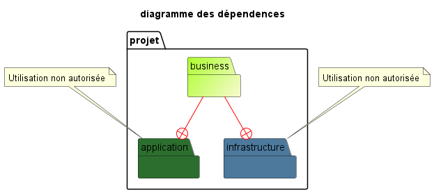

== Business

=== Les règles

IMPORTANT: Le module **Business** doit-être complétement autonome link:../architecture/src/test/java/org/example/structure/architecture/CheckArchitectureBusinessTest.java[contrôle]

=== Packages

.Composition du module
[options="header,footer"]
|=======================
|   Package    |      implèmentation      | Description
|   services   |  interface adapters.in   | Contient les cases d'usages
|    rules     |                          | Ensemble de régles qui seront utilisées uniquement dans `services`
|    models    |                          | Les classes de données
| adapters.in  |                          | Interfaces pour les cases d'usages
| adapters.out |                          | Interfaces pour le module `infrastructure`
|=======================

=== Schema

