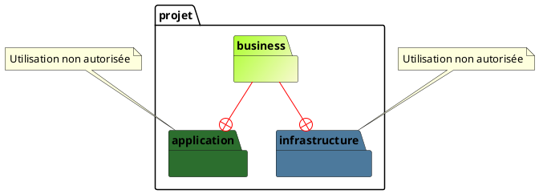
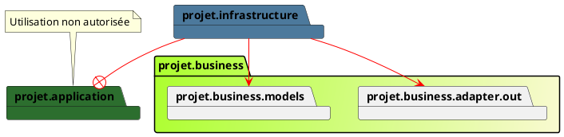
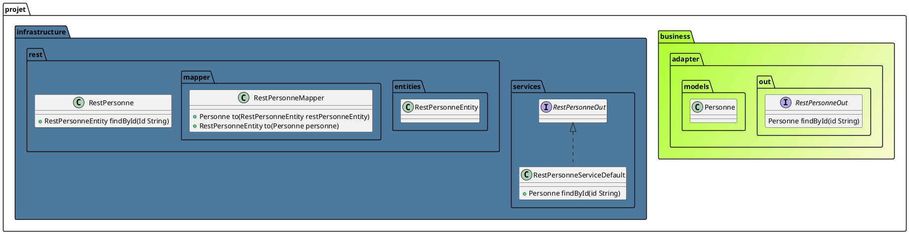
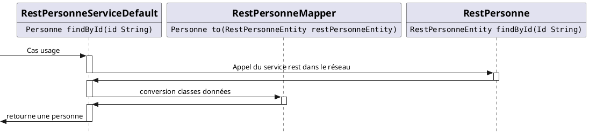
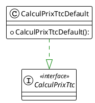

# Clean Architecture

# Les bases de cette architecture
La logique que vous implémentez doit :

   * Être indépendante des frameworks : les frameworks et librairies doivent être des outils, sans pour autant vous contraindre. 
   * Être testable indépendamment : les tests doivent pouvoir être réalisés sans éléments externes (interface utilisateur, base de données ...)
   * Être indépendante de l’interface utilisateur : l’interface utilisateur doit pouvoir changer de forme (console, interface web ...)
   * Être indépendante de la base de données : il doit être possible de changer de SGBD.
   * Être indépendante de tout service ou système externe : en résumé elle ne doit pas avoir conscience de ce qui l’entoure.


# Définition de la structure du projet

* Application : la partie des appels extérieurs
* Business : La partie métier
* Infrastructure : la partie de communication avec les infrastructures de l'entreprise

# Mise en place

* création d'un repository git
* copier le projet exemple dans un repertoire local

# Description des packages pour chaques modules

## Business
### Les règles

>Le module **Business** doit-être complétement autonome [contrôle](architecture/src/test/java/org/example/structure/architecture/CheckArchitectureBusinessTest.java)

### Packages

|   Package    |      implèmentation      | Description                                                        |
|:------------:|:------------------------:|:-------------------------------------------------------------------|
|   services   |  interface adapters.in   | Contient les cases d'usages                                        |
|    rules     |                          | Ensemble de régles qui seront utilisées uniquement dans `services` |
|    models    |                          | Les classes de données                                             |
| adapters.in  |                          | Interfaces pour les cases d'usages                                 |
| adapters.out |                          | Interfaces pour le module `infrastructure`                          |

### Schema

## Infrastructure
### Les règles

>Le module **Infrastructure** ne doit avoir uniquement les dépendences suivantes :
>* implementer une interface du module **Business** du package `adapters.out`
>* avec les models module **Business**


### Packages

|       Package       |     implèmentation     | Description                                           |
|:-------------------:|:----------------------:|:------------------------------------------------------|
|      services       | interface adapters.out | Usages définis dans le module **Business**            |
|     repository      |                        | Les appels DB                                         |
| repository.entities |                        | Les classes de données pour la DB                     |
|  repository.mapper  |                        | Convertisseurs entities/DB -> model de **business**   |
|        soap         |                        | Les appels en SOAP                                    |
|    soap.entities    |                        | Les classes de données pour les appels en SOAP        |
|     soap.mapper     |                        | Convertisseurs entities/SOAP -> model de **business** |
|        rest         |                        | Les appels REST                                       |
|    rest.entities    |                        | Les classes de données pour les appels en REST        |
|     rest.mapper     |                        | Convertisseurs entities/REST -> model de **business** |

Exemple :
Nous devons développer un service REST qui doit interroger un service du réseau interne
afin de rechercher une personne depuis son id.
Voici la définition des différents éléments dans les modules **business** et **infrastructure**

Le déroulement des différents appels sont sous la forme suivante :



## Application
### Les règles

>

### Packages

|   Package    |      implèmentation      | Description                                                        |
|:------------:|:------------------------:|:-------------------------------------------------------------------|
|   services   |  interface adapters.in   | Contient les cases d'usages                                        |
|    rules     |                          | Ensemble de régles qui seront utilisées uniquement dans `services` |
|    models    |                          | Les classes de données                                             |
| adapters.in  |                          | Interfaces pour les cases d'usages                                 |
| adapters.out |                          | Interfaces pour le module `infrastructure`                          |

### Schema

Code :
```java
package org.example.structure.business.services;

import org.example.structure.business.rules.TtcRule;
import org.example.structure.business.adapters.in.CalculPrixTtc;

public class CalculPrixTtcDefault implements CalculPrixTtc {
    @Override
    public double apply(double prixHtc, int taux) {
        TtcRule ttcRule = new TtcRule();
        return ttcRule.calcule(prixHtc, taux);
    }
}
```
Test
```java
package org.example.structure.business.services;

import org.junit.jupiter.api.Test;

import static org.assertj.core.api.Assertions.assertThat;

class CalculPrixTtcDefaultTest {
    /**
     * Method under test: {@link CalculPrixTtcDefault#apply(double, int)}
     */
    @Test
    void apply() {
        assertThat((new CalculPrixTtcDefault()).apply(5.0d, 0)).isEqualTo(5.0d);
        assertThat((new CalculPrixTtcDefault()).apply(5.0d, 100)).isEqualTo(10.0d);
        assertThat((new CalculPrixTtcDefault()).apply(5.0d, 75)).isEqualTo(8.75d);
        assertThat((new CalculPrixTtcDefault()).apply(5.0d, 50)).isEqualTo(7.50d);
        assertThat((new CalculPrixTtcDefault()).apply(5.0d, 25)).isEqualTo(6.25d);
        assertThat((new CalculPrixTtcDefault()).apply(10.5d, 15)).isEqualTo(12.075d);
        assertThat((new CalculPrixTtcDefault()).apply(0.0d, 1)).isEqualTo(0.0d);
        assertThat((new CalculPrixTtcDefault()).apply(-0.5d, 1)).isEqualTo(0.0d);
    }
}
```
#### Partie `Application`


### Appel
# Ressources
[clean-architecture](https://leandeep.com/clean-architecture/)
[la-clean-architecture-couteau-suisse-du-code](https://easypartner.fr/blog/la-clean-architecture-couteau-suisse-du-code/)
[ArchUnit-Examples](https://github.com/TNG/ArchUnit-Examples/blob/main/example-plain/src/test/java/com/tngtech/archunit/exampletest/LayeredArchitectureTest.java)
